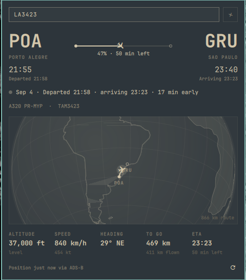

# Flight Monitor

An Omarchy shell bar widget that tracks one flight by its number.



Click the plane icon in the bar, type a flight number such as `LA3195`
(or an ICAO callsign such as `TAM3195`) and press Enter. The popup shows:

- the route: origin and destination airports, the scheduled departure and
  arrival in each airport's local time, and what actually happened to them
  ("Departed 19:05", "Arriving 21:57", "Landed 21:56", delays)
- a status line: "Sep 4 · Departed 19:05 · arriving 21:57 · on time"
- a rail between the airports with the aircraft's progress: by position
  when one is known, by the clock (real departure → ETA) when nobody can
  see the aircraft, marked "estimated"
- a globe card: the Earth seen from above the route (orthographic
  projection, zoomed to the route), with continents, a graticule, the
  great-circle track, the path already flown drawn solid, and the aircraft
  at its live position pointing along its heading
- altitude, ground speed, heading, distance to go, and the ETA
- how fresh the position is, and a warning when the aircraft is not on the
  leg listed for that flight number

The tracked flight is stored in `~/.config/omarchy/shell.json`, so it
survives shell restarts. Clear it with the ✕ next to the field.

## Requirements

- Omarchy with `omarchy-shell` (the Quickshell-based bar)
- `curl` (ships with Omarchy) and internet access
- No API keys, no sudo, no install hooks, no extra packages

## Installation

```bash
omarchy plugin add https://github.com/maluta/flight.monitor.git --enable
```

`--enable` places the plane icon in the bar's right section. Move it with:

```bash
omarchy bar move io.github.maluta.flight-monitor --section center
```

Manual install, without the plugin manager: clone this repository into
`~/.config/omarchy/plugins/io.github.maluta.flight-monitor/`, then run
`omarchy-shell shell rescanPlugins` and `omarchy plugin enable io.github.maluta.flight-monitor right`.

Update later with `omarchy plugin update io.github.maluta.flight-monitor`.

## Removal

```bash
omarchy plugin remove io.github.maluta.flight-monitor
```

This deletes the plugin directory and takes the widget out of the bar. To
keep the files but hide the widget, use `omarchy plugin disable io.github.maluta.flight-monitor`
instead.

## What it writes

The only thing the plugin writes is the flight number, into its own layout
entry in `~/.config/omarchy/shell.json` (`{ "id": "io.github.maluta.flight-monitor", "flight": "LA3195" }`),
and only when you press Enter in the field, clear it with ✕, or call the
`track`/`clear` IPC commands. It never touches any other file, and removing
the plugin removes that entry with it.

## Bar icon

| Click  | Action                                   |
|--------|------------------------------------------|
| Left   | Open / close the popup                   |
| Middle | Open the popup with the field focused    |
| Right  | Refresh the position now                 |

The icon is dimmed while nothing is tracked. While the flight is in the
air the percentage of the trip done sits next to it (horizontal bars).

## Keyboard (popup open)

| Key         | Action                     |
|-------------|----------------------------|
| Enter, `/`  | Focus the flight field     |
| `r`         | Refresh                    |
| Esc         | Leave the field / close    |
| Tab         | Switch to the next panel   |

## IPC

```bash
omarchy-shell io.github.maluta.flight-monitor toggle
omarchy-shell io.github.maluta.flight-monitor edit             # open with the field focused
omarchy-shell io.github.maluta.flight-monitor track LA3195     # start tracking a flight
omarchy-shell io.github.maluta.flight-monitor clear
omarchy-shell io.github.maluta.flight-monitor refresh
```

## Settings (inline in the bar layout entry)

| Key              | Default | Meaning                                  |
|------------------|---------|------------------------------------------|
| `flight`         | `""`    | Flight number being tracked              |
| `refreshSeconds` | `60`    | Background poll interval (15–600). While the popup is open it polls every 15 s. |

## Data sources

All public, none needs an API key:

- [Flightradar24](https://www.flightradar24.com/) (unofficial endpoints,
  fetched with a browser user agent) gives the schedule: scheduled,
  estimated and actual times, status, the aircraft's hex and registration,
  the airports with coordinates and time zones, and, as a fallback for the
  position, the path flown so far. The list mixes future and past dates;
  the panel picks the instance that is live, else the next one still to
  arrive, else the most recent landed one.
- [adsb.lol](https://api.adsb.lol/) provides the live ADS-B position,
  altitude, speed and track, looked up by hex first and then by callsign.
- [adsbdb.com](https://www.adsbdb.com/) supplies the airline name, and the
  route when Flightradar24 does not answer.

A flight number is an IATA code (`LA3195`) while the aircraft broadcasts an
ICAO callsign (`TAM3195`). Airline groups use several callsign prefixes for
one IATA code, so the callsign lookup walks a short candidate list (see
`CALLSIGN_PREFIXES` in `Model.js`) and remembers whichever answered.

The Flightradar24 endpoints are unofficial and may change or stop answering
without notice. When they do, the widget falls back to adsbdb + adsb.lol:
route and live position still work, but scheduled times and status do not.

## Network and limits

Every request is a plain `curl` over https only, with no redirects, a
timeout of 8–10 s, and a byte cap enforced before anything is parsed:
1 MiB for the schedule, 256 KiB for the route, 512 KiB for the live
position and 4 MiB for the trail. A body over its cap is discarded, not
truncated and parsed. Arguments reach the shell as positional parameters,
never spliced into the command text.

Values that come back from the feeds are bounded before they become state:
strings are cut to 64 characters, coordinates, altitudes, speeds and
timestamps outside their physical range are dropped, at most 50 schedule
rows, 200 aircraft and 5000 trail points are read, and anything reused in a
later URL (hex address, callsign, Flightradar24 flight id) must match a
strict alphabet or is ignored. All text is rendered as plain text.

## Files

- `BarWidget.qml` — the bar icon and IPC target; hosts the panel
- `Panel.qml` — the popup, fetching and all rendering
- `Model.js` — Qt-free parsing, great-circle math, the globe projection and
  formatting (`node -e 'require("./Model.js")'` works for quick checks)
- `World.js` — land outlines for the globe: Natural Earth 1:110m land
  (public domain), outer rings simplified to ~2,000 points. Regenerate by
  fetching `ne_110m_land.geojson` from github.com/nvkelso/natural-earth-vector
  and running Douglas-Peucker at 0.35° on each outer ring

## License

MIT, see `LICENSE`. Land outlines in `World.js` are derived from Natural
Earth, which is in the public domain.
